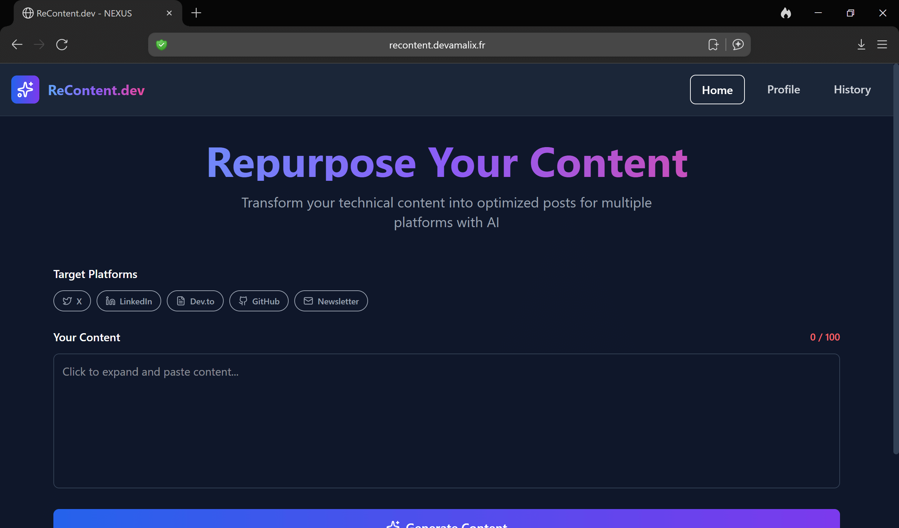
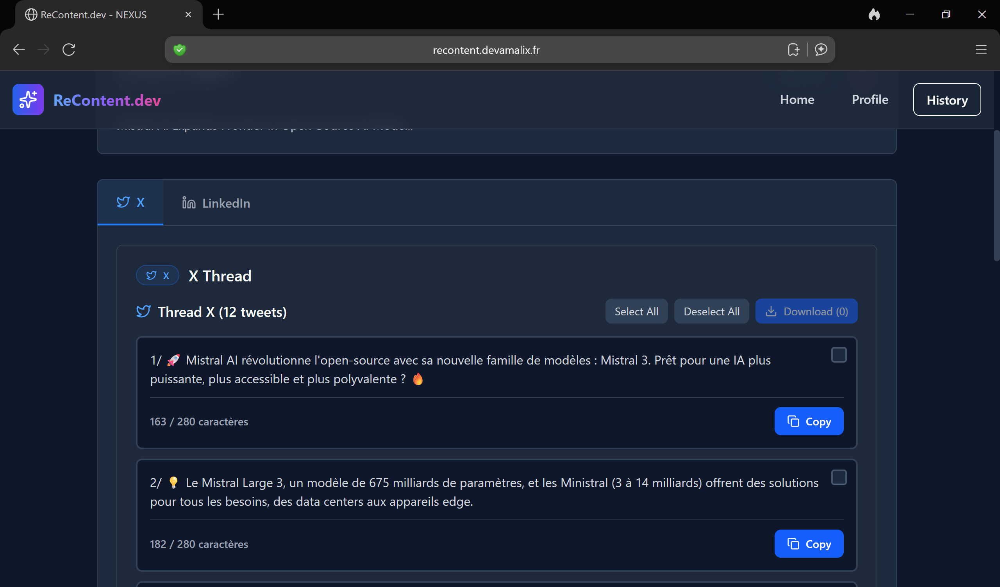
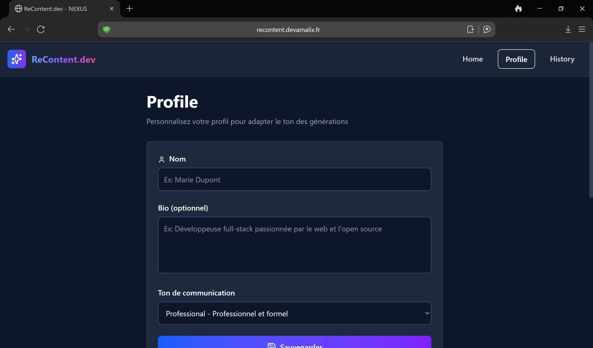
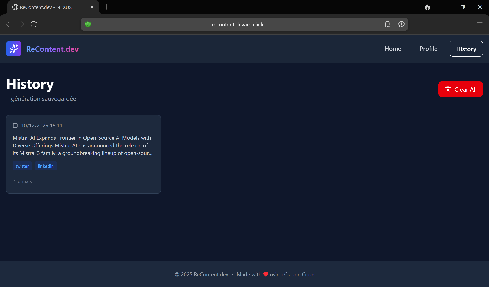

# 🚀 ReContent.dev

[](https://recontent.devamalix.fr)
[](https://recontent.devamalix.fr)
[](https://github.com/MatthALXdev/recontent/actions)
[](docs/TESTS.md)
[](https://www.docker.com/)
[](LICENSE)

> Outil intelligent de reformulation de contenu multi-plateformes alimenté par l'IA Mistral.

Transformez votre contenu technique en posts optimisés pour Twitter, LinkedIn, Dev.to, GitHub et Newsletter grâce à l'IA Mistral. Application fullstack moderne avec interface React et API Node.js performante.

---

## 🚀 Demo Live

**[https://recontent.devamalix.fr](https://recontent.devamalix.fr)**

Scannez le QR code pour tester :

<div align="center">
  
</div>

---

## 📸 Screenshots

### Interface Principale

*Interface de génération avec sélection multi-plateformes*

### Résultats Multi-Plateformes

*Résultats formatés pour chaque plateforme avec copie en un clic*

### Profil Utilisateur & Historique
<div align="center">
  
  
</div>

---

## ✨ Fonctionnalités

### Génération Multi-Plateformes
- 🐦 **Twitter Threads** - Threads numérotés optimisés (8-12 tweets, 280 char/tweet)
- 💼 **Posts LinkedIn** - Format professionnel avec hashtags pertinents (max 1300 char)
- 📝 **Articles Dev.to** - Markdown structuré prêt à publier (500-800 mots)
- 🔧 **README GitHub** - Structure professionnelle avec badges et sections
- 📧 **Newsletter Email** - Format optimisé mobile (300-500 mots)

### Interface & UX
- 🤖 **IA Mistral** - Génération intelligente adaptée à chaque plateforme
- 👤 **Profil personnalisé** - Adaptez le ton (Casual/Professional/Technical)
- 📋 **Copie rapide** - Bouton de copie dans le clipboard pour chaque format
- 📚 **Historique** - Sauvegarde locale de vos 20 dernières générations
- 🔍 **Recherche** - Recherche full-text dans l'historique
- 🎨 **Dark Mode** - Interface sombre moderne et responsive
- ⚡ **Real-time** - Compteur de caractères et validation instantanée
- 🔔 **Notifications** - Toast notifications pour chaque action

### Technique
- ✅ **Tests automatisés** - 53+ tests (API + Frontend)
- ✅ **CI/CD** - GitHub Actions avec déploiement automatique
- ✅ **Docker** - Conteneurisation complète (3 services)
- ✅ **Sécurité** - Rate limiting, CORS, validation inputs
- ✅ **Performance** - Nginx reverse proxy, cache optimisé

---

## 🛠️ Stack Technique

### Frontend
- **React 19.1.1** - Interface utilisateur réactive avec hooks modernes
- **React Router DOM 7.9.3** - Routing côté client (SPA)
- **Vite 7.1.7** - Build tool ultra-rapide avec HMR
- **Tailwind CSS 4.1.14** - Framework CSS utility-first avec dark mode
- **Lucide React 0.544.0** - Bibliothèque d'icônes SVG moderne
- **Axios 1.12.2** - Client HTTP pour les appels API
- **Vitest 4.0.10** - Framework de test moderne et rapide

### Backend
- **Node.js 20** (Alpine Linux) - Runtime JavaScript
- **Express 4.18.2** - Framework web minimaliste et performant
- **Mistral AI API** - Modèle `mistral-small-latest` pour la reformulation
- **Axios 1.6.2** - Client HTTP pour Mistral API
- **CORS 2.8.5** - Gestion des requêtes cross-origin
- **Vitest 4.0.10** - Tests unitaires backend

### Infrastructure
- **Docker** - Conteneurisation multi-services
- **Docker Compose** - Orchestration (frontend + API + nginx)
- **Nginx Alpine** - Reverse proxy et serveur de fichiers statiques
- **Traefik v3** - Reverse proxy HTTPS externe (production)
- **Let's Encrypt** - Certificats SSL automatiques

### DevOps
- **GitHub Actions** - CI/CD automatisé (tests, build, deploy)
- **Supertest 7.1.4** - Tests d'intégration API
- **ESLint 9.36.0** - Linting JavaScript/React
- **PostCSS & Autoprefixer** - Optimisation CSS

---

## 📁 Structure du Projet

```
recontent/
├── README.md                  # Documentation (vous êtes ici)
│
├── api/                       # Backend Node.js
│   ├── index.js               # Serveur Express + routes
│   ├── services/
│   │   └── mistral.js         # Intégration Mistral AI
│   ├── config/
│   │   ├── cors.js            # Configuration CORS
│   │   ├── logger.js          # Logging Winston
│   │   └── rateLimiter.js     # Rate limiting
│   ├── middleware/
│   │   └── validator.js       # Validation inputs
│   ├── __tests__/
│   │   ├── health.test.js     # Tests health check (127 lignes)
│   │   └── generate.test.js   # Tests génération (517 lignes)
│   └── package.json           # Dépendances backend
│
├── frontend/                  # Frontend React
│   ├── src/
│   │   ├── pages/
│   │   │   ├── Home.jsx       # Interface génération
│   │   │   ├── Profile.jsx    # Configuration profil
│   │   │   └── History.jsx    # Historique générations
│   │   ├── components/
│   │   │   ├── Header.jsx     # Navigation
│   │   │   ├── ResultsTabs.jsx # Affichage résultats
│   │   │   ├── CopyButton.jsx # Copie clipboard
│   │   │   └── LoadingSpinner.jsx
│   │   ├── services/
│   │   │   ├── mistralAPI.js  # Client API
│   │   │   └── storage.js     # LocalStorage wrapper
│   │   └── contexts/
│   │       └── ToastContext.jsx
│   ├── __tests__/             # Tests React (15+ tests)
│   ├── vite.config.js         # Configuration Vite
│   ├── tailwind.config.js     # Configuration Tailwind
│   └── package.json           # Dépendances frontend
│
├── nginx/
│   ├── recontent.conf         # Config reverse proxy
│   └── entrypoint.sh          # Script démarrage
│
├── docs/                      # 📚 Documentation centralisée
│   ├── ARCHITECTURE.md        # Architecture technique
│   ├── DESIGN_SYSTEM.md       # Design & UI/UX
│   ├── DEPLOYMENT.md          # Guide déploiement
│   ├── SECURITY.md            # Mesures sécurité
│   ├── CONTRIBUTING.md        # Guide contribution
│   └── TESTS.md               # Guide tests complet
│
├── .github/
│   └── workflows/
│       └── ci.yml             # Pipeline CI/CD
│
├── docker-compose.yml         # Production orchestration
├── docker-compose.dev.yml     # Développement local
├── .env.example               # Template variables env
└── .gitignore, .dockerignore
```

---

## 🎨 Design System

### Palette de Couleurs

**Dark Mode (défaut)** :
```css
--bg-primary: #0f172a        /* Background principal */
--bg-secondary: #1e293b      /* Cards, sections */
--text-primary: #f1f5f9       /* Texte principal */
--text-secondary: #cbd5e1     /* Texte secondaire */
--accent-blue: #3b82f6        /* Boutons, liens */
--accent-green: #10b981       /* Success, validation */
--accent-red: #ef4444         /* Erreurs, alertes */
```

### Composants Principaux
- **Header** : Navigation sticky avec logo et menu
- **ResultsTabs** : Tabs pour chaque plateforme (Twitter, LinkedIn, etc.)
- **CopyButton** : Bouton copie avec feedback visuel
- **LoadingSpinner** : Animation chargement
- **Toast** : Notifications contextuelles

> 📖 **Specs complètes** : Voir [docs/DESIGN_SYSTEM.md](docs/DESIGN_SYSTEM.md)

---

## 📦 Installation

### Prérequis

**Production (Docker)** :
- Docker 24+ & Docker Compose v2+
- Clé API Mistral AI ([obtenir gratuitement](https://console.mistral.ai/))

**Développement local** :
- Node.js 20+
- npm 10+

---

### Démarrage Rapide (Docker)

```bash
# 1. Cloner le repository
git clone https://github.com/MatthALXdev/recontent.git
cd recontent

# 2. Configurer les variables d'environnement
cp .env.example .env
nano .env
# Ajouter : MISTRAL_API_KEY=sk-xxxxxxxxxxxxxxxx

# 3. Lancer l'application
docker compose up -d

# 4. Vérifier le statut
docker compose ps

# 5. Accéder à l'application
# → http://localhost:8090/recontent/
```

**Health Check** :
```bash
# Vérifier Nginx
curl http://localhost:8090/health
# → OK - ReContent API

# Vérifier API
curl http://localhost:3002/health | jq
# → {"status":"OK","service":"ReContent API","mistral_configured":true}
```

---

### Développement Local (Sans Docker)

```bash
# Terminal 1 - Frontend
cd frontend
npm install
npm run dev
# → http://localhost:5173

# Terminal 2 - API
cd api
npm install
cp ../.env.example ../.env
nano ../.env  # Ajouter MISTRAL_API_KEY
npm start
# → http://localhost:3002
```

> 📖 **Guide détaillé** : Voir [docs/DEPLOYMENT.md](docs/DEPLOYMENT.md)

---

## 💻 Utilisation

### Workflow Standard

1. **📝 Profil** (optionnel)
   - Configurez votre nom, bio et ton (Casual/Professional/Technical)
   - Sauvegarde automatique en LocalStorage

2. **✍️ Saisie Contenu**
   - Collez votre contenu original (minimum 100 caractères)
   - Compteur de caractères en temps réel

3. **🎯 Sélection Plateformes**
   - Choisissez une ou plusieurs plateformes cibles
   - Twitter, LinkedIn, Dev.to, GitHub, Newsletter

4. **🤖 Génération IA**
   - Cliquez sur "Generate"
   - Mistral AI adapte le contenu pour chaque plateforme

5. **📋 Copie & Utilisation**
   - Onglets pour chaque plateforme générée
   - Bouton "Copy" pour copier dans le clipboard
   - Édition manuelle possible avant copie

6. **📚 Historique**
   - Consultez vos 20 dernières générations
   - Recherche full-text
   - Suppression individuelle ou globale

---

## 🏗️ Architecture

### Vue d'Ensemble

```
┌─────────────────────────────────────────────────────────┐
│                    INTERNET (HTTPS)                      │
└────────────────────┬────────────────────────────────────┘
                     │
                     ▼
          ┌─────────────────────┐
          │   Traefik v3 (VPS)  │
          │   Reverse Proxy      │
          │   Let's Encrypt      │
          └──────────┬───────────┘
                     │
                     ▼
          ┌─────────────────────┐
          │   Nginx (Alpine)     │
          │   Port: 80           │
          └──────┬───────┬───────┘
                 │       │
      /recontent/│       │/api/recontent/
                 │       │
                 ▼       ▼
       ┌──────────┐   ┌──────────┐
       │ Frontend │   │   API    │
       │  React   │   │ Express  │
       │  (dist/) │   │ Port 3002│
       └──────────┘   └────┬─────┘
                           │
                           ▼
                   ┌───────────────┐
                   │  Mistral AI   │
                   │  API External │
                   └───────────────┘
```

### Services Docker

| Service | Image | Port | Rôle | Restart |
|---------|-------|------|------|---------|
| **recontent-frontend** | node:20-alpine | - | Build Vite (one-shot) | no |
| **recontent-api** | node:20-alpine | 3002 | API Express | unless-stopped |
| **nginx-recontent** | nginx:alpine | 8090→80 | Reverse proxy + static | unless-stopped |

**Réseau** : `recontent-network` (isolé, interne)

### Flux de Requête

```
1. User → https://recontent.devamalix.fr
          ↓
2. Traefik (VPS) → Route vers nginx-recontent
          ↓
3. Nginx → /recontent/ → Frontend React (SPA)
      ↓
4. React → fetch /api/recontent/generate
      ↓
5. Nginx → Proxy → recontent-api:3002
      ↓
6. Express → Axios → Mistral AI API
      ↓
7. Mistral → Génération contenu
      ↓
8. Response → Nginx → React → User
```

> 📖 **Architecture détaillée** : Voir [docs/ARCHITECTURE.md](docs/ARCHITECTURE.md)

---

## 🔧 Commandes Docker

### Gestion de Base

```bash
# Démarrer la stack
docker compose up -d

# Arrêter la stack
docker compose down

# Logs en temps réel
docker compose logs -f

# Logs d'un service spécifique
docker compose logs -f recontent-api
docker compose logs -f nginx-recontent

# Statut des services
docker compose ps

# Statistiques ressources
docker stats recontent-api nginx-recontent
```

### Maintenance

```bash
# Redémarrer un service
docker compose restart recontent-api

# Rebuild frontend (après modif)
docker compose up recontent-frontend

# Rebuild complet
docker compose down
docker compose up -d --build

# Nettoyer tout (⚠️ supprime volumes)
docker compose down -v
```

---

## 🧪 Tests

### Tests Automatisés

**Backend (API)** :
```bash
# Lancer tests avec Docker
docker compose --profile test run --rm recontent-test

# OU en local
cd api
npm test              # Run une fois
npm run test:coverage # Avec coverage
```

**Tests API** (38 tests) :
- Health check endpoints
- Content generation (single + multi-platform)
- Input validation
- Error handling
- Timeout scenarios
- Profile customization

**Frontend (React)** :
```bash
# En local
cd frontend
npm test              # Mode watch
npm run test:run      # Run une fois
npm run test:coverage # Avec coverage
```

**Tests Frontend** (15 tests) :
- CopyButton component
- Home page interactions
- mistralAPI service
- storage service (LocalStorage)

### Coverage

| Suite | Tests | Coverage | Lignes |
|-------|-------|----------|--------|
| **API** | 38 | 67% | 644 lignes |
| **Frontend** | 15 | 77% | ~300 lignes |
| **Total** | 53+ | ~70% | - |

> 📖 **Guide tests complet** : Voir [docs/TESTS.md](docs/TESTS.md)

---

## 🛠️ API Reference

### GET `/health`

Health check de l'API.

**Réponse** :
```json
{
  "status": "OK",
  "service": "ReContent API",
  "timestamp": "2025-12-10T14:27:09.295Z",
  "mistral_configured": true
}
```

---

### POST `/api/recontent/generate`

Génère du contenu reformulé pour plusieurs plateformes.

**Headers** :
```
Content-Type: application/json
```

**Body** :
```json
{
  "content": "Votre contenu original (min 100 caractères, max 10000)",
  "platforms": ["twitter", "linkedin", "devto", "github", "newsletter"],
  "profile": {
    "name": "John Doe",
    "bio": "Developer advocate chez ACME Corp",
    "tone": "professional"
  }
}
```

**Validation** :
- `content` : string, 100-10000 caractères
- `platforms` : array, au moins 1, valeurs: twitter|linkedin|devto|github|newsletter
- `profile.tone` : string, valeurs: casual|professional|technical

**Réponse Success** :
```json
{
  "success": true,
  "results": {
    "twitter": "1/ Thread about...\n\n2/ Second tweet...",
    "linkedin": "📌 Professional post with hashtags...",
    "devto": "# Article Title\n\n## Introduction...",
    "github": "# Project Name\n\n[![Badge]...]",
    "newsletter": "Subject: Newsletter title\n\nBody..."
  },
  "platforms_processed": 5,
  "usage": {
    "prompt_tokens": 150,
    "completion_tokens": 500,
    "total_tokens": 650
  }
}
```

**Erreurs** :
```json
// 400 Bad Request - Validation error
{
  "success": false,
  "error": "Content must be between 100 and 10000 characters"
}

// 500 Internal Server Error - Mistral API error
{
  "success": false,
  "error": "Mistral API error: Rate limit exceeded"
}
```

---

### POST `/api/recontent/repurpose` (Legacy)

Endpoint de compatibilité pour génération single-platform.

**Body** :
```json
{
  "content": "Original content...",
  "format": "twitter"
}
```

> ⚠️ **Note** : Utilisez `/generate` pour de meilleures performances.

---

## 🔒 Sécurité

### Mesures Appliquées

**API** :
- ✅ **Rate Limiting** : 200 req/15min (général), 100 req/15min (generation)
- ✅ **CORS** : Whitelist domaines autorisés
- ✅ **Input Validation** : Longueur, formats, caractères
- ✅ **Secrets Management** : `.env` hors Git
- ✅ **Error Handling** : Pas de leak d'infos sensibles

**Infrastructure** :
- ✅ **HTTPS forcé** (Let's Encrypt)
- ✅ **Nginx hardening** : Headers sécurité
- ✅ **Docker isolation** : Réseau interne
- ✅ **Healthchecks** : Monitoring santé services

**Frontend** :
- ✅ **LocalStorage only** : Pas de données serveur
- ✅ **XSS protection** : React escaping automatique
- ✅ **CSP Headers** : Content Security Policy

> 📖 **Détails sécurité** : Voir [docs/SECURITY.md](docs/SECURITY.md)

---

## 📊 Performance

### Métriques

| Métrique | Valeur | Cible |
|----------|--------|-------|
| **First Contentful Paint (FCP)** | ~1.2s | < 1.5s ✅ |
| **Largest Contentful Paint (LCP)** | ~1.8s | < 2.5s ✅ |
| **Time to Interactive (TTI)** | ~2.5s | < 3.5s ✅ |
| **Bundle Size (Frontend)** | ~180 KB | < 250 KB ✅ |
| **API Response Time** | ~2-5s | < 10s ✅ |

### Optimisations

**Frontend** :
- ✅ Vite build optimisé (code splitting)
- ✅ Lazy loading composants
- ✅ Tailwind CSS purge (production)
- ✅ Assets minifiés

**Backend** :
- ✅ Nginx gzip compression
- ✅ Cache headers (1 an pour assets)
- ✅ Axios timeout (30s)
- ✅ Rate limiting

---

## 📝 Roadmap

### ✅ Phase 1 : MVP (Terminée)
- [x] Interface React + Vite
- [x] Intégration Mistral AI
- [x] 5 plateformes (Twitter, LinkedIn, Dev.to, GitHub, Newsletter)
- [x] Système de profil utilisateur
- [x] Historique LocalStorage (20 items)
- [x] Dockerisation complète
- [x] Reverse proxy Nginx

### ✅ Phase 2 : Tests & Qualité (Terminée)
- [x] Tests unitaires API (38 tests)
- [x] Tests unitaires Frontend (15 tests)
- [x] Coverage >70% (API: 67%, Frontend: 77%)
- [x] CI/CD GitHub Actions
- [x] Linting ESLint

### ✅ Phase 3 : Production (Terminée)
- [x] Déploiement VPS
- [x] HTTPS Let's Encrypt
- [x] Domaine personnalisé (recontent.devamalix.fr)
- [x] Traefik integration
- [ ] Monitoring Uptime Kuma (prévu)

### 🎯 Phase 4 : Fonctionnalités Avancées (À venir)
- [ ] Templates de prompts personnalisables
- [ ] Plus de plateformes (Reddit, Medium, Bluesky)
- [ ] Statistiques d'utilisation
- [ ] Mode hors ligne avec cache
- [ ] Export multi-formats (PDF, DOCX)
- [ ] API publique avec authentification
- [ ] Webhooks pour intégrations

---

## 🤝 Contribution

Les contributions sont les bienvenues ! Consultez [CONTRIBUTING.md](docs/CONTRIBUTING.md) pour :

- Workflow Git (branches, commits)
- Conventions de code (JavaScript, React)
- Process de review
- Guide tests

**Quick Start Contribution** :
```bash
# 1. Fork le repository
# 2. Clone ton fork
git clone https://github.com/ton-username/recontent.git

# 3. Créer branche feature
git checkout -b feature/ma-feature

# 4. Développer & tester
npm test

# 5. Commit (Conventional Commits)
git commit -m "feat: add new platform support"

# 6. Push & Pull Request
git push origin feature/ma-feature
```

---

## 📚 Documentation

| Document | Description |
|----------|-------------|
| [ARCHITECTURE.md](docs/ARCHITECTURE.md) | Architecture technique complète (frontend, backend, infra) |
| [DESIGN_SYSTEM.md](docs/DESIGN_SYSTEM.md) | Design system, UI/UX, composants |
| [DEPLOYMENT.md](docs/DEPLOYMENT.md) | Guide déploiement (local, Docker, VPS) |
| [SECURITY.md](docs/SECURITY.md) | Mesures sécurité, rate limiting, validation |
| [CONTRIBUTING.md](docs/CONTRIBUTING.md) | Guide contribution, conventions, workflow |
| [TESTS.md](docs/TESTS.md) | Guide tests complet (API, Frontend, coverage) |

---

## 📄 License

**MIT License** - Voir [LICENSE](LICENSE) pour plus de détails.

Ce projet est open-source et gratuit. Vous pouvez l'utiliser, le modifier et le distribuer librement.

---

## 👤 Auteur

**Matthieu Alix**
Développeur Fullstack DevOps

- 🌐 **Portfolio** : [me.devamalix.fr](https://me.devamalix.fr)
- 💼 **LinkedIn** : [matthieu-alix](https://linkedin.com/in/matthieu-alix)
- 🐙 **GitHub** : [@MatthALXdev](https://github.com/MatthALXdev)
- 📧 **Email** : matth.alx.dev@gmail.com

---

## 🙏 Remerciements

- **Mistral AI** pour l'API de génération de contenu
- **Vite** pour le build tool ultra-rapide
- **Tailwind CSS** pour le framework CSS moderne
- **Docker** pour la conteneurisation simplifiée
- **Communauté Open Source** pour les bibliothèques utilisées

---

<div align="center">

**Fait avec ❤️ et beaucoup de ☕**

**Dernière mise à jour** : Décembre 2025

[⬆️ Retour en haut](#-recontentdev)

</div>
